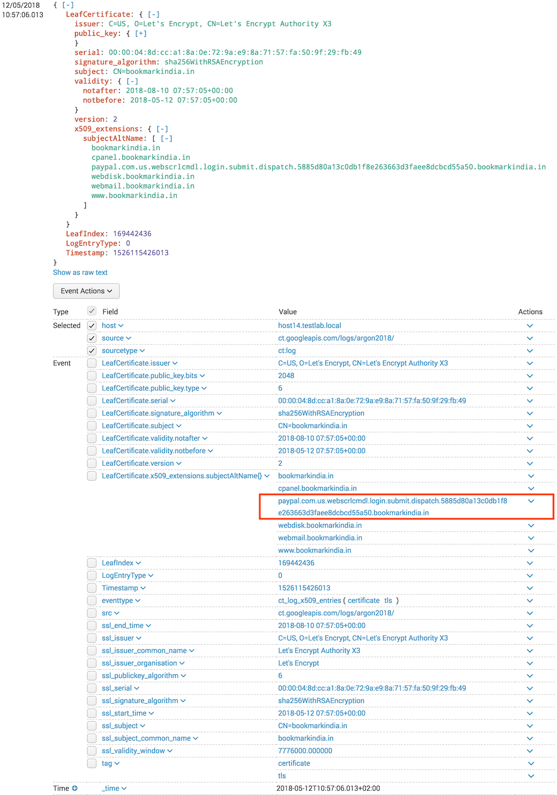

# Certificate Transparency Log Monitor for Splunk

This add-on for Splunk can be used to monitor certificate transparency logs.
For example to watch certificates issued for your domains or malicious look-a-likes.

It outputs the certificate logs as CIM compliant events in Splunk. This allows you to create an alert in Splunk or Splunk Enterprise Security that fires when a certificate gets issued for your-domain-followed-by-suspicious-fishing-domain.

## Supported Splunk versions and platforms

| Splunk version | Linux | Windows
|----------------|-------|---------
| 6.3            | Yes   | Yes
| 6.4            | Yes   | Yes
| 6.5            | Yes   | Yes
| 6.6            | Yes   | Yes
| 7.0            | Yes   | Yes
| 7.1            | Yes   | Yes
| 7.2            | Yes   | Yes
| 7.3            | Yes   | Yes
| 8.0            | Yes   | Yes

Additional requirements:

* Splunk heavy forwarder instance: Splunk Universal Forwarder is not supported due to Python dependencies
* KVstore: used to keep track of the most recently seen ct log entry

## Install the TA-ct-log add-on for Splunk

### Single instance Splunk deployments

1. In Splunk, click on "Manage Apps"
2. Click "Browse more apps", search for "TA-ct-log" and install the add-on

### Distributed Splunk deployments

| Instance type | Supported | Required | Description
|---------------|-----------|----------|------------
| Heavy Forwarder     | Yes | Yes      | Install this add-on on a heavy forwarder to get Certificate Transparency Logs into Splunk
| Search head   | Yes       | Yes      | Install this add-on on your search head(s) where CIM compliance of CT Logs is required
| Indexer       | Yes       | No       | There is no need to install this add-on on an indexer. This add-on should be installed on a heavy forwarder that does the index time parsing. 
| Universal Forwarder | No  | No       | This add-on is not supported on a Universal Forwarder because it requires Python

The following table lists support for distributed deployment roles in a Splunk deployment:

| Deployment role | Supported | Description
|-----------------|-----------|-------------
| Search head deployer | Yes  | Install this add-on on your search head deployer to enable CIM compliance of CT Logs in a Search Head Cluster
| Cluster Master       | No  | There is no need to install this add-on on a Cluster Master. This add-on should be installed on a heavy forwarder that performs parsing at index time. 
| Deployment Server    | Depends  | This add-on can be (1) deployed unconfigured to a client or (2) deployed preconfigured. 

## Configure TA-ct-log add-on for Splunk

1. Go to the Input tab of the Certificate Transparency add-on for Splunk
2. Click "Create new Input"
3. Configure:
    * Name: e.g. argon2018
    * Interval: how often to poll the certificate log for new entries
    * Index: what Splunk index to send the certificate log events to
    * Certificate Log URL: the base url of the log e.g. "ct.googleapis.com/logs/argon2018/", without https:// and without the API endpoint) for more urls see [https://www.gstatic.com/ct/log_list/all_logs_list.json](https://www.gstatic.com/ct/log_list/all_logs_list.json)

## Events in Splunk

The add-on extracts these certificate fields and maps them to the corresponding fields in the CIM Certificate datamodel.

- Certificate subject (DN)
- Certificate issuer (DN)
- Certificate subjectAltName extension
- Certificate serial
- Certificate validity
- Certificate signature algorithm
- Certificate version
- Public key bit size
- Public key type
- Log metadata: LogEntryType (0=x509, 1=precert) and Timestamp

In Splunk a certificate most likely used for Paypal phishing looks like this:

An example using punycode to obfuscate another Paypal phishing site:

## Current RFC6962 compliance

Chapter 5.3 of the RFC specifies a number of steps that a monitor should implement.
Currently only steps 5 and 7 are partially implemented, and the current status can be summarized as: "It gets logs. Period."

| Step | Implemented? | Description
|------|--------------|-----------
| 1    |    n         | Fetch the current STH
| 2    |    n         | Verify the STH signature
| 3    |    n         | Fetch all the entries in the tree corresponding to the STH
| 4    |    n         | Confirm that the tree made from the fetched entries produces the same hash as that in the STH
| 5    |    Y         | Fetch the current STH (Section 4.3). Repeat until the STH changes
| 6    |    n         | Verify the STH signature
| 7    |    Y         | Fetch all the new entries in the tree corresponding to the STH (Section 4.6).  If they remain unavailable for an extended period, then this should be viewed as misbehavior on the part of the log.

Because the current implementation lacks signature verification, it cannot be used to monitor the append-only character of the certificate transparency log Feel free to submit a Pull Request, or wait for future releases to implement these verification features.

### Supported data structures

| Data structure       | Implemented? | Log endpoint      | Description
|----------------------|--------------|-------------------|-------------
| MerkleTreeLeaf       |    Y         | ct/v1/get-entries | The structure containing TimestampedEntries
| TimestampedEntry     |    Y         | ct/v1/get-entries | The structure containing x509_entry or precert_entry
| x509_entry           |    Y         | ct/v1/get-entries | Certificates entries
| precert_entry        |    n         | ct/v1/get-entries | Pre-certificate entries
| TreeHeadSignature    |    n         | ct/v1/get-sth     | 

## Support

This is an open source project without warranty of any kind. No support is provided. However, a public repository and issue tracker are available here at Github.

## Third party software credits

The following software components are used in this add-on:

1. [Splunk Add-on Builder](https://docs.splunk.com/Documentation/AddonBuilder/2.2.0/UserGuide/Overview) version 2.2.0 by Splunk and the [third-party software](https://docs.splunk.com/Documentation/AddonBuilder/2.2.0/UserGuide/Thirdpartysoftwarecredits) it uses
2. [asn1crypto](https://pypi.org/project/asn1crypto/0.24.0/) version 0.24.0 by Will Bond

## CHANGELOG

### 1.3.0

- Added support for Splunk 8.x and Python 3.x
- Added Argon2023 CTL
- Removed Argon2018 CTL

### 1.2.2

- Fixed exception when parsing Latin-1 encoded certificate fields

### 1.2.1

- Fixed exception when parsing Windows-1252 encoded certificate fields
- Fixed exception when parsing asn1 of huge paypal phishing subjectaltname

### 1.2.0

- Added x509 extension subjectAltName decoding
- Added tags for CIM Certificate datamodel

### 1.1.0

- Added CIM compliant fields
- Added Log status dashboard
- Improved performance by not checkpointing every entry index in KVstore

### 1.0.1

- Fixed timestamp issue in props.conf
- Added leaf index field to facilitate gap detection
- Added more documentation

### 1.0.0

Initial release with support for x509_entries

